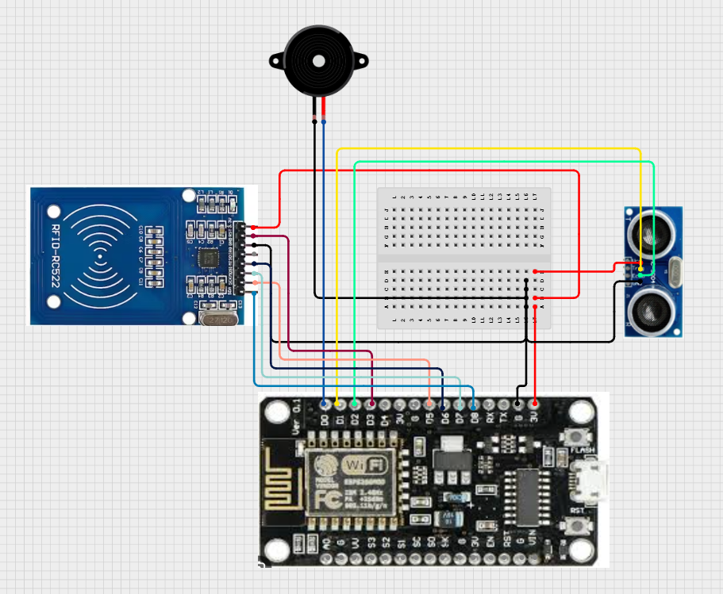
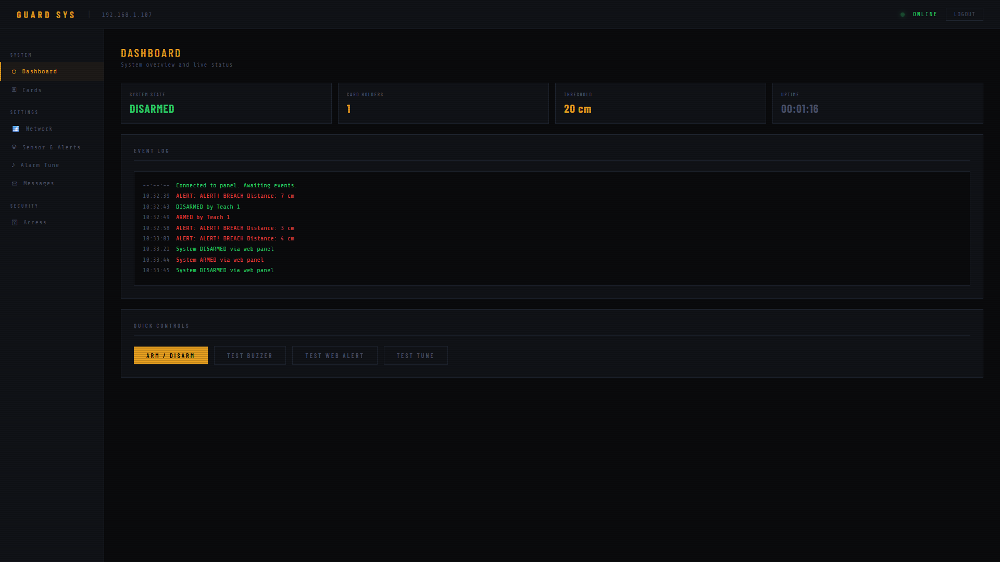
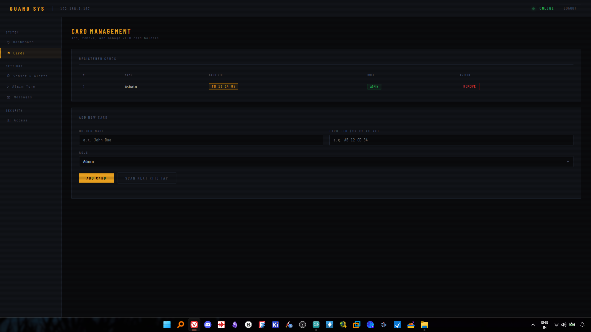
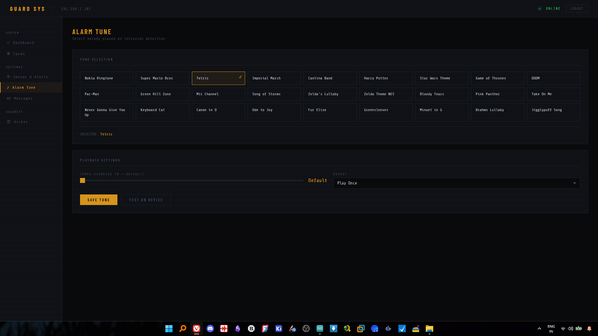

# GUARD SYS — ESP8266 RFID Security System

A web-configurable security system built on the **ESP8266** microcontroller featuring RFID-based access control, ultrasonic intrusion detection, a passive buzzer alarm with 27 built-in tunes, and a full browser-based management panel — all without any cloud dependency.

---

## Table of Contents

- [Features](#features)
- [Hardware Requirements](#hardware-requirements)
- [Wiring Diagram](#wiring-diagram)
- [Software Dependencies](#software-dependencies)
- [Installation & Flashing](#installation--flashing)
- [First Boot & Wi-Fi Setup](#first-boot--wi-fi-setup)
- [Web Panel](#web-panel)
  - [Dashboard](#dashboard)
  - [Card Management](#card-management)
  - [Sensor Settings](#sensor-settings)
  - [Tune / Alarm Settings](#tune--alarm-settings)
  - [Custom Messages](#custom-messages)
  - [Wi-Fi Settings](#wi-fi-settings)
  - [Access / Password](#access--password)
- [API Reference](#api-reference)
- [Configuration & Persistence](#configuration--persistence)
- [Message Templates](#message-templates)
- [Web Alert System](#web-alert-system)
- [Available Alarm Tunes](#available-alarm-tunes)
- [Default Configuration Values](#default-configuration-values)
- [Customization](#customization)
- [Troubleshooting](#troubleshooting)
- [Contributors](#contributors)

---

## Features

- **RFID Access Control** — Arm/disarm the system by tapping registered RFID cards/fobs (up to 10 cards). Each card stores a code.
- **Ultrasonic Intrusion Detection** — HC-SR04 sensor continuously monitors distance while armed. Triggers an alarm if motion is detected within a configurable threshold.
- **Web Management Panel** — Full-featured browser UI served directly from the ESP8266. No app, no cloud, no external server required.
- **Web Alert System** — Fullscreen flashing red modal with audible browser siren on intrusion or unauthorized card swipe.
- **Terminal Log** — Live event log in the browser showing arm/disarm events and system activity.
- **27 Built-in Alarm Tunes** — Selectable alarm melody played on the buzzer (Nokia, Mario, Tetris, Imperial March, Harry Potter, Star Wars, and more).
- **AP Fallback Mode** — If Wi-Fi credentials are missing or wrong, the device auto-creates a hotspot (`GUARD_SYS_SETUP`) for initial configuration.
- **Persistent Configuration** — All settings (cards, Wi-Fi, sensor, tunes, messages) are saved to LittleFS flash and survive reboots.
- **Password-Protected Panel** — All API endpoints require a panel password, sent as an HTTP header or query parameter.
- **Configurable Alert Messages** — All system messages support dynamic template variables (`{NAME}`, `{UID}`, `{DISTANCE}`, `{TIME}`).

---

## Hardware Requirements

| Component | Description |
|---|---|
| **ESP8266 Board** | NodeMCU v1/v2, Wemos D1 Mini, or any ESP8266 breakout |
| **MFRC522 RFID Reader** | 13.56 MHz SPI RFID module with cards/fobs |
| **HC-SR04** | Ultrasonic distance sensor (3.3 V–tolerant version recommended, or use a voltage divider on ECHO) |
| **Passive Buzzer** | Passive (not active) buzzer for tone generation |
| **RFID Cards/Fobs** | RFID cards, stickers, or keyfobs |
| **Power Supply** | USB 5 V via micro-USB, or regulated 3.3 V |

---

## Wiring Diagram


```
ESP8266 (NodeMCU)       Peripheral
─────────────────       ──────────
D1  (GPIO 5)    ──────► HC-SR04  TRIG
D2  (GPIO 4)    ◄────── HC-SR04  ECHO
D0  (GPIO 16)   ──────► Buzzer   (+)
GND             ──────► Buzzer   (-)
GND             ──────► HC-SR04  GND
3V3             ──────► HC-SR04  VCC

SPI Bus (MFRC522)
─────────────────
D5  (GPIO 14)  CLK  ──► MFRC522  SCK
D6  (GPIO 12)  MISO ◄── MFRC522  MISO
D7  (GPIO 13)  MOSI ──► MFRC522  MOSI
D8  (GPIO 15)  SS   ──► MFRC522  SDA (SS)
D3  (GPIO 0)   RST  ──► MFRC522  RST
3V3                 ──► MFRC522  3.3V
GND                 ──► MFRC522  GND
```

> **Note:** The HC-SR04 ECHO pin outputs 5 V logic. Use a voltage divider (1 kΩ + 2 kΩ) or a level shifter to protect the ESP8266's 3.3 V GPIO.

---

## Software Dependencies

Install all libraries through the **Arduino Library Manager** (Sketch → Include Library → Manage Libraries):

| Library | Purpose |
|---|---|
| `ESP8266WiFi` | Wi-Fi connectivity (bundled with ESP8266 core) |
| `ESP8266WebServer` | HTTP server (bundled with ESP8266 core) |
| `LittleFS` | Flash filesystem for config persistence (bundled) |
| `SPI` | SPI bus communication (bundled) |
| `MFRC522` | RFID reader driver — install by **GithubCommunity** |
| `ArduinoJson` | JSON serialization/deserialization — install **v6.x** by Benoit Blanchon |

**Board support:** Install the ESP8266 core via **File → Preferences → Additional Board Manager URLs**:
```
https://arduino.esp8266.com/stable/package_esp8266com_index.json
```
Then go to **Tools → Board → Board Manager** and install **esp8266 by ESP8266 Community**.

---

## Installation & Flashing

1. **Clone or download** this repository and open `code.ino` in the Arduino IDE.
2. **Select your board:** Tools → Board → ESP8266 Boards → `NodeMCU 1.0 (ESP-12E Module)` (or the appropriate variant).
3. **Set flash size:** Tools → Flash Size → `4MB (FS: 2MB, OTA: ~1MB)` (ensure LittleFS has space).
4. **Set credentials** in the `Config` struct defaults at the top of the code:
   ```cpp
   String ssid     = "SSID";     // Change SSID
   String wifiPass = "PASSWORD"; // Change Wi-Fi Password
   String panelPass = "admin";   // Change initial panel Password
   ```
> These are default values and cannot be changed after flashing, the datas can be changed only on the Web, this is because the code checks if you have a config.json in the board using LittleFS

5. **Upload the sketch** via USB. Monitor the output at **115200 baud** in the Serial Monitor.

---

## First Boot & Wi-Fi Setup

On startup the device attempts to connect to the configured Wi-Fi network for ~20 seconds.

**Successful connection:**
- Serial prints the assigned IP address.
- Buzzer beeps **twice**.
- Navigate to `http://<IP_ADDRESS>` in your browser.

**Failed connection — AP Fallback Mode:**
- Device creates a hotspot: **SSID:** `GUARD_SYS_SETUP` / **Password:** `PASSWORD`
- Buzzer plays a 4-note ascending chime (C4-E4-G4-C5).
- Connect to the hotspot and navigate to `http://192.168.4.1`.
- Go to the **Wi-Fi** settings panel, enter your credentials, and save. The device will reboot and connect.

> **Tip:** Change the AP hotspot password by editing this line in `setup()`:
> ```cpp
> WiFi.softAP("GUARD_SYS_SETUP", "PASSWORD");
> ```

---

## Web Panel

The management panel is served at `http://<IP_ADDRESS>` or `http://192.168.4.1` (If on AP Fallback Mode). All sections require the panel password (default: `admin`).

### Dashboard



Displays live system status:

- **Armed / Disarmed** status with toggle button
- **IP Address**, **Uptime**, **Card count**, **Detection threshold**
- **Terminal log** — scrollable live event feed (arm/disarm events, unauthorized card swipes)
- **Arm/Disarm button** — instantly changes system state from the browser

When an intrusion or unauthorized card is detected, a **fullscreen red alert modal** overlays the entire browser tab with the alert message and an audio siren.

### Card Management



- **View** all registered cards in a table showing UID, name, and role badge.
- **Scan to Add** — click "Scan Card", tap an RFID card to the reader; the UID is auto-populated. Enter a name and role, then save.
- **Manual Add** — enter a UID, name, and role directly.
- **Remove** any card with the delete button.
- Maximum of **10 cards** supported.
- Roles: `admin` (green badge) or `user` (amber badge). Both roles can arm/disarm equally.

### Sensor Settings

| Setting | Description |
|---|---|
| **Detection Threshold** | Distance in cm below which an intrusion is triggered (slider, 1–200 cm) |
| **Scan Interval** | How often the ultrasonic sensor is polled in ms (default 100 ms) |
| **Buzz on Detect** | Play the alarm tune when an intrusion is detected |
| **Web Alert on Detect** | Push the alert modal to the browser on intrusion |
| **Cooldown Mode** | Send only one alert per intrusion event (suppress repeat alerts until cleared) |

### Tune / Alarm Settings



- **Song Grid** — click any of the 27 tunes to select it as the alarm sound.
- **Repeat Count** — how many times the tune loops on trigger (0 = infinite until disarmed).
- **Tempo Override** — set a custom BPM (0 = use the tune's default tempo).
- **Test Tune** button — plays the selected tune immediately.
- **Test Buzz** button — fires a simple 3-beep test.

### Custom Messages

All system notification messages are fully customizable. Supported template variables:

| Variable | Replaced With |
|---|---|
| `{NAME}` | Card holder's registered name |
| `{UID}` | Raw RFID card UID |
| `{DISTANCE}` | Detected distance in cm |
| `{TIME}` | System uptime in seconds |

**Configurable messages:**
- **Online** — sent when system boots
- **Armed** — sent when a card arms the system
- **Disarmed** — sent when a card disarms the system
- **Alert** — sent to browser on intrusion detection
- **Unauthorized** — sent when an unregistered card is scanned

### Wi-Fi Settings

Change the SSID and Wi-Fi password. Saving triggers an automatic reboot to apply changes.

### Access / Password

Change the web panel password. Requires entering the current password to confirm. The new password is saved immediately and takes effect on the next request.

---

## API Reference

All endpoints require authentication via either:
- HTTP header: `X-Panel-Pass: <password>`
- Query parameter: `?pass=<password>`

Unauthorized requests receive `401 {"error":"Unauthorized"}`.

| Method | Endpoint | Description |
|---|---|---|
| `GET` | `/api/status` | System status, armed state, IP, uptime, pending alerts/logs |
| `POST` | `/api/arm` | Arm or disarm. Body: `state=1` (arm) or `state=0` (disarm) |
| `GET` | `/api/cards` | List all registered cards |
| `POST` | `/api/cards/add` | Add a card. Body: `uid`, `name`, `role` |
| `POST` | `/api/cards/remove` | Remove a card. Body: `uid` |
| `POST` | `/api/scan` | Puts reader in scan-and-capture mode. UID returned on next `/api/status` poll |
| `POST` | `/api/sensor` | Save sensor settings. Body: `threshold`, `interval`, `buzz`, `notify`, `cooldown` |
| `GET` | `/api/tunes` | List all available tunes with index, name, and default tempo |
| `POST` | `/api/tune` | Set alarm tune. Body: `index`, `repeat`, `tempo` |
| `POST` | `/api/tune/test` | Trigger a test playback of the current tune |
| `POST` | `/api/buzz/test` | Trigger a 3-beep test |
| `POST` | `/api/messages` | Save custom message templates. Body: `online`, `armed`, `disarmed`, `alert`, `unauth` |
| `POST` | `/api/access` | Change panel password. Body: `current`, `newpass` |
| `GET` | `/api/config` | Retrieve full current configuration (no passwords) |
| `POST` | `/api/webalert/test` | Send a test alert to the browser panel |

---

## Configuration & Persistence

All configuration is stored in **LittleFS** as `/config.json`. The file is written on every save action from the panel and loaded on boot.

**Stored fields:** `ssid`, `wifiPass`, `panelPass`, `threshold`, `scanInterval`, `buzzOnDetect`, `notifyDetect`, `cooldown`, `tuneIndex`, `tuneRepeat`, `tempoOverride`, `msgOnline`, `msgArmed`, `msgDisarmed`, `msgAlert`, `msgUnauth`, and the full `cards` array (uid, name, role per entry).

> If LittleFS fails to mount on boot, the filesystem is automatically formatted and re-mounted with default values.

---

## Message Templates

Templates are plain strings with optional `{VARIABLE}` placeholders. Examples:

```
"ARMED by {NAME}"                          → "ARMED by Alice"
"ALERT! BREACH Distance: {DISTANCE} cm"   → "ALERT! BREACH Distance: 14 cm"
"Unauthorized Card: {UID}"                → "Unauthorized Card: A1 B2 C3 D4"
"System Online at {TIME}s uptime"         → "System Online at 5s uptime"
```

---

## Web Alert System

The panel implements a **long-poll style alert** system:

- The browser polls `/api/status` every second.
- If the response contains a new `alertId`, the browser shows a **fullscreen red flashing modal** with the alert message and plays an audio siren in the tab.
- The modal stays until the user clicks **DISMISS ALERT**.
- Log messages (`logId` / `logMsg`) are appended to the terminal without a modal.

This allows any browser tab with the panel open to act as a live monitoring station.

---

## Available Alarm Tunes

27 melodies are stored in PROGMEM (flash memory) to minimize RAM usage:

| # | Name | # | Name |
|---|---|---|---|
| 0 | Nokia Ringtone | 14 | Zelda Theme NES |
| 1 | Super Mario Bros | 15 | Bloody Tears |
| 2 | Tetris | 16 | Pink Panther |
| 3 | Imperial March | 17 | Take On Me |
| 4 | Cantina Band | 18 | Never Gonna Give You Up |
| 5 | Harry Potter | 19 | Keyboard Cat |
| 6 | Star Wars Theme | 20 | Canon in D |
| 7 | Game of Thrones | 21 | Ode to Joy |
| 8 | DOOM | 22 | Für Elise |
| 9 | Pac-Man | 23 | Greensleeves |
| 10 | Green Hill Zone | 24 | Minuet in G |
| 11 | Mii Channel | 25 | Brahms Lullaby |
| 12 | Song of Storms | 26 | Jigglypuff Song |
| 13 | Zelda's Lullaby | | |

> Taken From robsoncouto's [arduino-songs](https://github.com/robsoncouto/arduino-songs) Repo

---

## Default Configuration Values

| Parameter | Default |
|---|---|
| Wi-Fi SSID | `SSID` |
| Wi-Fi Password | `PASSWD` |
| Panel Password | `admin` |
| Detection Threshold | `20 cm` |
| Scan Interval | `100 ms` |
| Buzz on Detect | `true` |
| Web Alert on Detect | `true` |
| Cooldown Mode | `true` |
| Default Tune | `0` (Nokia Ringtone) |
| Tune Repeat | `1` |
| Tempo Override | `0` (use tune default) |

---

## Customization

**Changing the AP hotspot name/password:**
```cpp
WiFi.softAP("GUARD_SYS_SETUP", "PASSWORD");  // in setup()
```

**Changing default credentials at compile time:**
```cpp
struct Config {
  String ssid     = "SSID";
  String wifiPass = "PASSWORD";
  String panelPass = "admin";
  ...
};
```

**Changing pin assignments:**
```cpp
const int trigPin   = 5;   // D1 — HC-SR04 TRIG
const int echoPin   = 4;   // D2 — HC-SR04 ECHO
const int buzzerPin = 16;  // D0 — Passive Buzzer
#define SS_PIN  15          // D8 — MFRC522 SS
#define RST_PIN 0           // D3 — MFRC522 RST
```

**Adding more cards:** Increase `MAX_CARDS` and update the `DynamicJsonDocument` sizes accordingly.

---

## Troubleshooting

| Symptom | Likely Cause | Fix |
|---|---|---|
| RFID reader not detected | Wiring error or wrong SPI pins | Double-check SS (D8) and RST (D3) connections |
| Sensor always triggering | Threshold too high or wiring issue | Lower threshold in Sensor Settings; check HC-SR04 wiring |
| Panel shows 401 Unauthorized | Wrong or missing password | Default password is `admin` |
| Device creates hotspot instead of joining Wi-Fi | Wrong SSID/password | Connect to `GUARD_SYS_SETUP` hotspot and update Wi-Fi in panel |
| No sound from buzzer | Active buzzer used instead of passive | Replace with a **passive** buzzer |
| LittleFS mount failed (Serial) | First flash or corrupted FS | Normal on first boot — device formats automatically |
| Web alert modal not appearing | Browser tab not focused or polling stopped | Keep the panel tab open; check browser console for errors |
| Config not saving across reboots | Flash size set too small | Set Flash Size to `4MB (FS: 2MB)` in Arduino Tools menu |

## Contributors

This is a college project developed as a socially relevant initiative.

| Name | Role | GitHub |
|---|---|---|
| Aridlvory | Lead Developer | [@aridlvory](https://github.com/aridlvory) |
| Pranav R | Co Developer | [@PrenevR](https://github.com/PrenevR) |
| Parthiv J Prasad | Hardware Design | No account yet |
| Mohammed Hussain A | Case Designer | No account yet |
